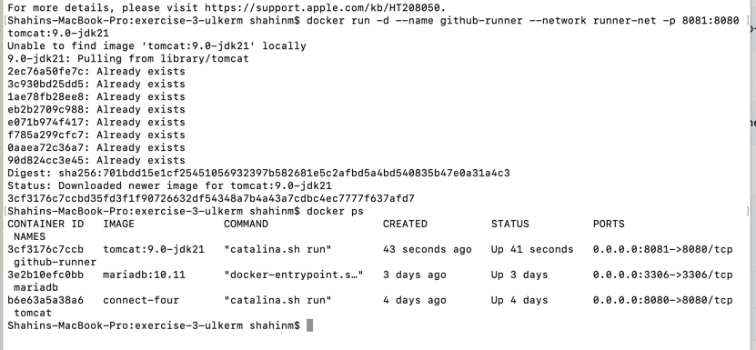
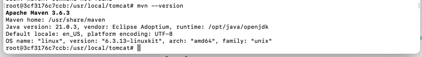
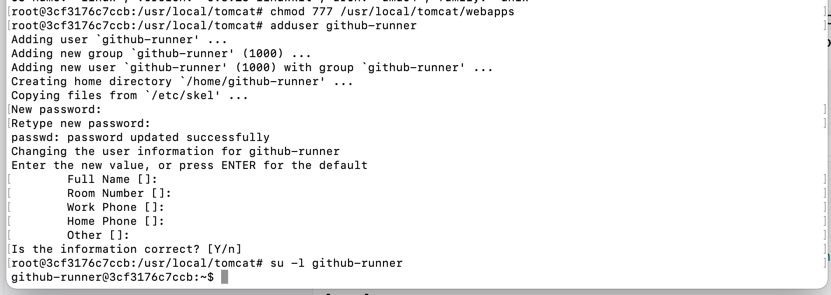

SPW4 - Exercise 3
=================

Name: _____________

Effort in hours: __

## 1. Connect Four Web Application and CI/CD Pipeline

### Task 1.a

<!--- describe your solution here --->

### Task 1.b

<!--- describe your solution here --->

### Task 1.c

<!--- describe your solution here --->
Github-runner container is running.

maven was installed in the github runner.

new user was created.

